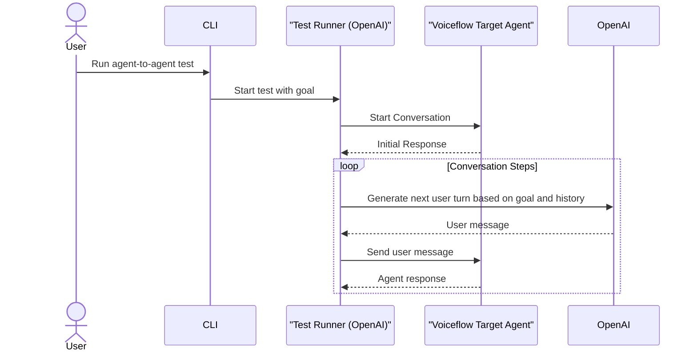
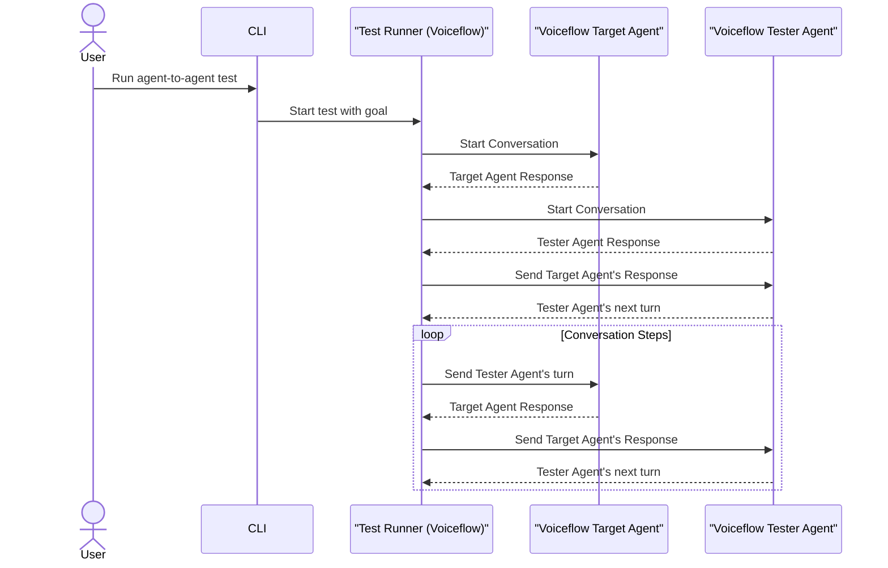

### OpenAI as Tester

```mermaid
sequenceDiagram
    actor User
    participant CLI
    participant TestRunner as "Test Runner (OpenAI)"
    participant TargetAgent as "Voiceflow Target Agent"
    participant OpenAI

    User->>CLI: Run agent-to-agent test
    CLI->>TestRunner: Start test with goal
    
    TestRunner->>TargetAgent: Start Conversation
    TargetAgent-->>TestRunner: Initial Response
    
    loop Conversation Steps
        TestRunner->>OpenAI: Generate next user turn based on goal and history
        OpenAI-->>TestRunner: User message
        TestRunner->>TargetAgent: Send user message
        TargetAgent-->>TestRunner: Agent response
    end
```

### Voiceflow Agent as Tester

```mermaid
sequenceDiagram
    actor User
    participant CLI
    participant TestRunner as "Test Runner (Voiceflow)"
    participant TargetAgent as "Voiceflow Target Agent"
    participant TesterAgent as "Voiceflow Tester Agent"

    User->>CLI: Run agent-to-agent test
    CLI->>TestRunner: Start test with goal

    TestRunner->>TargetAgent: Start Conversation
    TargetAgent-->>TestRunner: Target Agent Response

    TestRunner->>TesterAgent: Start Conversation
    TesterAgent-->>TestRunner: Tester Agent Response

    TestRunner->>TesterAgent: Send Target Agent's Response
    TesterAgent-->>TestRunner: Tester Agent's next turn

    loop Conversation Steps
        TestRunner->>TargetAgent: Send Tester Agent's turn
        TargetAgent-->>TestRunner: Target Agent Response
        TestRunner->>TesterAgent: Send Target Agent's Response
        TesterAgent-->>TestRunner: Tester Agent's next turn
    end
```
